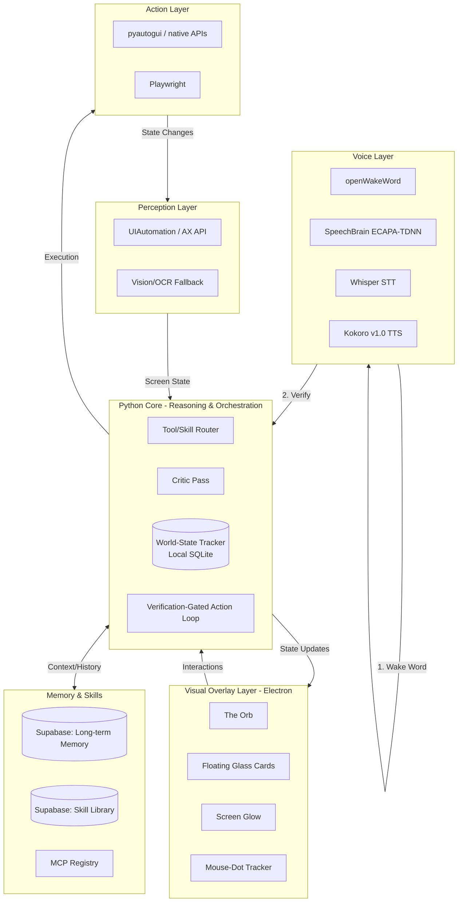

# System Architecture

## 1. Overview
JAR is composed of six distinct subsystems that communicate via a local WebSocket/HTTP event bus, anchored by a centralized World-State Tracker.

1. **Perception Layer**: Screen understanding via OS Accessibility APIs (UIAutomation/AX API) + Vision fallback.
2. **Action Layer**: Mouse/keyboard control and browser automation.
3. **Reasoning & Orchestration Layer**: Plan generation, confidence scoring, critic pass, and verification gating.
4. **Memory & Skill System**: Supabase for long-term memory/skills; MCP for external tools.
5. **Visual Overlay Layer**: Electron-based transparent window for the Orb, screen glow, and cards.
6. **Voice Layer**: Wake-word (openWakeWord), Speaker Verification (SpeechBrain), STT (Whisper), TTS (Kokoro).

## 2. System Diagram

## 3. Communication Patterns
- **Backend (Python)** acts as the central hub. It runs a local WebSocket server (FastAPI).
- **Frontend (Electron)** connects to the WebSocket to receive state pushes (e.g., `status: thinking`, `confidence: high`) and drives the React/WebAudio UI animations instantly.
- **Event Bus**: Subsystems in Python communicate via `asyncio` event queues to ensure non-blocking operation (e.g., Voice Layer continuously listens and pushes to the Audio Queue, which triggers the Core).

## 4. Context Management & World-State
- **World-State Tracker**: An explicit, ephemeral local SQLite database. It tracks: active window, pending approvals, current task step, and recent failures.
- **Context Window Management**: LLM context is heavily curated. Rather than pushing full chat histories, the World-State is serialized into a concise JSON object on every tick. Long tasks append short summarized breadcrumbs, keeping token usage low and preventing context degradation.
- **"Take Over" Handoff**: When the user says "take over," the agent queries the World-State for the last 5 active windows/documents, avoiding the need for the LLM to deduce the entire context from scratch.

## 5. Verification-Gated Action Loop (Reliability Mechanism)
1. **Perceive**: Read UIA tree.
2. **Plan**: Formulate *one* action.
3. **Critic Pass**: Fast LLM check: "Is this action dangerous or irreversible?"
4. **Act**: Execute via Action Layer.
5. **Verify**: Re-read UIA tree. Did the text appear? Did the window open?
6. **On Failure**: Log causal failure to World-State. Retry with modified approach. Fallback to user if blocked.
